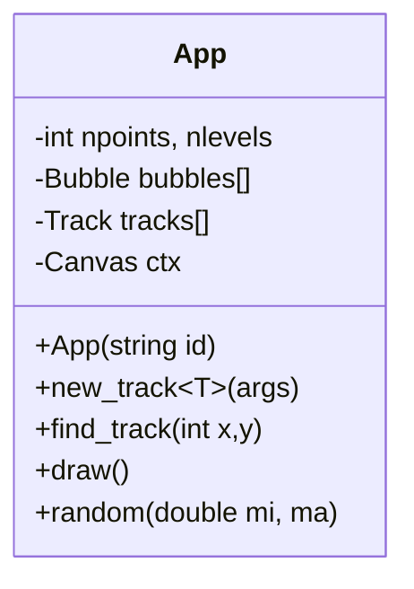

# Cloud Chamber

## How to compile

- Install Emscripten
- Activate Emscripten
- Compile
```bash
mkdir build
cd build
emcmake cmake ..
make
```
- Run
```bash
python -m http.server
```

- View in browser at http://localhost:8000/ui/

## Refs
- https://gist.github.com/WesThorburn/00c47b267a0e8c8431e06b14997778e4#
- https://marcelbraghetto.github.io/a-simple-triangle/2019/03/10/part-06/
- https://github.com/ArthurSonzogni/OpenGL_CMake_Skeleton/tree/master


## Class Structure

