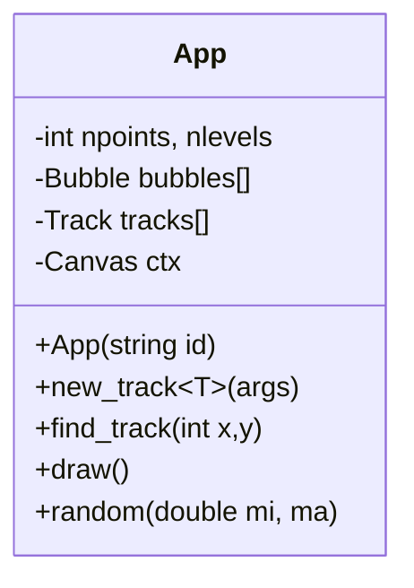

# Cloud Chamber

## How to compile

- Install Emscripten
- Activate Emscripten
- Compile
```bash
mkdir build
cd build
emcmake cmake ..
make
```
- Run
```bash
python -m http.server
```

- View in browser at http://localhost:8000/ui/


## Class Structure

