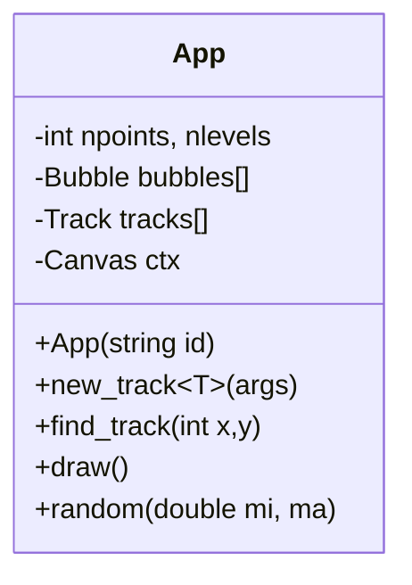

# Cloud Chamber

## Class Structure

```mermaid
classDiagram

      class App
    App :-int npoints, nlevels
    App :-Bubble bubbles[]
    App :-Track tracks[]
    App :-Canvas ctx
    App :+App(string id)
    App :+new_track~T~(args)
    App :+find_track(int x,y)
    App :+draw()
    App :+random(double mi, ma)
```